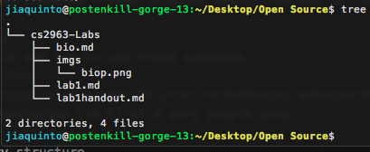
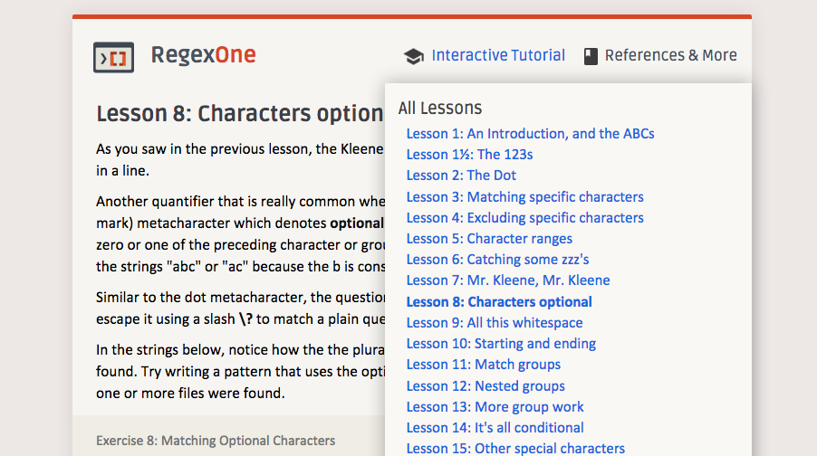
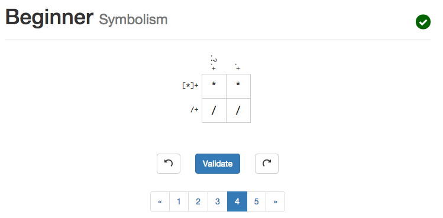
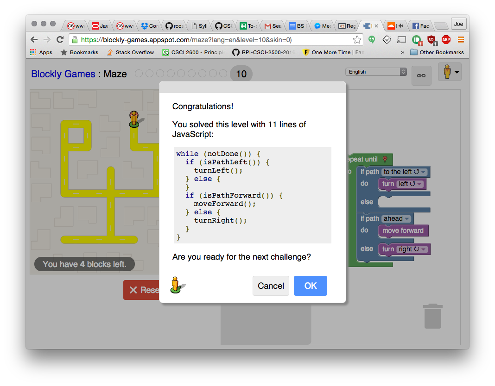

## Open Source Definition
  I think that the efforts of the Open Source Initiative to advocate for
  true open source and licensing use are very important and relevant to the
  everday developer.
## Smart Questions
  Try to think of coding as a loop. Read, Code, Debug, repeat. This way you can make sure you're making progress if you're stuck.
  Try asking yourself questions. Sometimes you can solve a lot by just asking yourself questions about your problem by discovering new ways to think about and explain it.
## Tree
  Here is the picture of using tree 
## Regex Tutorial
  Here is the picture of my completion of the regex tutorial 
## Regex game
  Here is the picture of my completion of the regex game 
## Blockly
  Here is my picture of my solution of blockly 
##Reflection
  I like to brainstorm ideas for convenient solutions to my everyday problems. In the hackathon
  last fall I made a skill for the Amazon Echo to interface with Github's API and tell you things
  about your repository. I'd like to discover more ways to use the Echo and enhance it's functionality.
